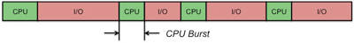
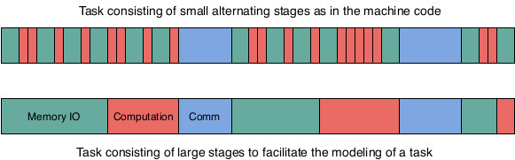
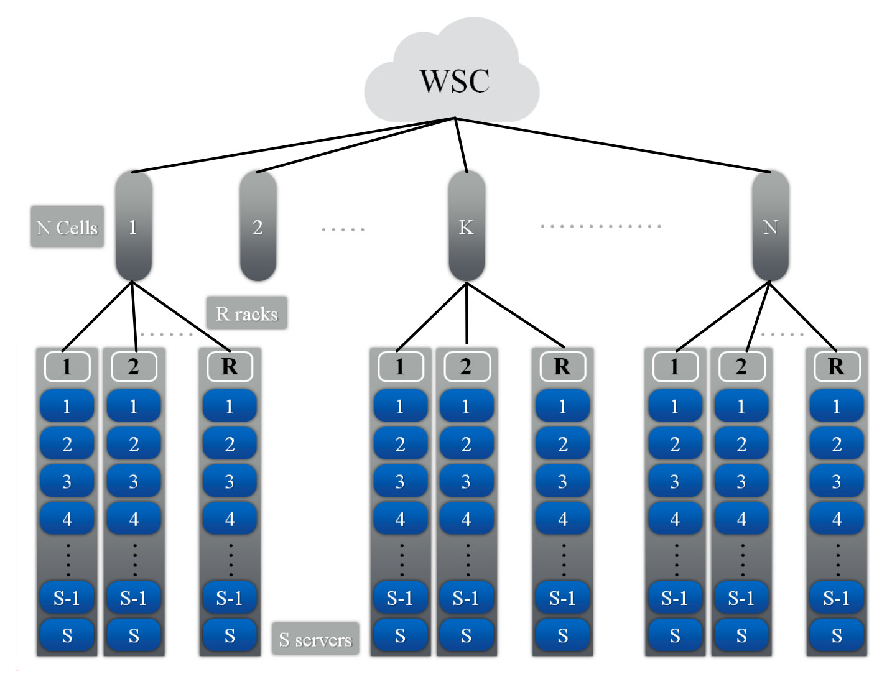

# Cloud Model
## Cloud user
<p style="text-align: justify;text-justify: inter-word;"> 
A cloud user is a person or organization that has access to the cloud and is allowed on demand usage of some of the cloud's resources for a limited time and for a predefined fee (based on the time of usage and the number of used resources). The cloud user reserves resources on the cloud to execute an application.
</p>


## Cloud resources
<p style="text-align: justify;text-justify: inter-word;"> 
A cloud consists mainly of many homogeneous servers interconnected by an Ethernet network. Each server might have many processors and each processor consists of many cores. The servers might also have accelerators such as GPUs and TPUs. The cloud user express its resource requirements to execute a Task in terms of VCPUs and memory. A VCPU can be the equivalent of one core or one core-thread on a server. Some cloud service providers force users to select resources for their tasks form a predefined list of instances. Each instance has a predefined number of VCPUs and memory. 
Even though the user cannot choose over which server the resources are reserved to execute a given task, they are all located on the same server. The resource manager does not reserve resources on different servers for the same task. If a task requires more resources than those available on a server, it should be partitioned into two or more tasks which can be deployed in parallel on different servers and communicate over the network by exchanging messages or remote call procedures.
</p>
## Sleeping states of the computing resources
<p style="text-align: justify;text-justify: inter-word;"> 
Modern processors and cores have many PC and C sleeping states respectively. They are used to reduce their energy consumption when they are idle. When  a core is put to a C-state higher than C0, it stops executing instructions and turn off some of its components. When a core moves to a deeper C-State it consumes less energy but requires more time to wake up from this deep sleep state in order to execute some instructions. When all the cores of a given processor are in a CX sleeping state, the processor can be also put to the PCX sleeping state. The PC state of a processor cannot be higher than the minimum C-state of its cores. If all the processors of a server are in their last PC-State, the whole server can be turned off to save even more energy.
</p>
## Task
<p style="text-align: justify;text-justify: inter-word;"> 
A task is deployed on the reserved resources on the cloud and can contain a predefined set of stages to execute over these resources. Those stages can be one of the following: Execute a number of instructions, Read/Write an amount of data from memory or local disks, send and receive data over the network, etc. Before the execution of the task on the reserved resources, an adapted environment that satisfies the requirements of the task must be available on these resources. The most common two scenarios for this situation are: 
<ul>
  <li style="text-align: justify;text-justify: inter-word;">A general environment that contains the most common packages is already available on the resources and the task's dependencies are all satisfied by this environment which is rarely the case for complex tasks. </li>
  <li style="text-align: justify;text-justify: inter-word;">The user has to build an environment that contains all the application's requirements, starting from the selection of the operating system and its configuration to the installation of all the required packages and services such as execution environments, databases, libraries, etc. An image of this environment can be saved into a file to be reused and deployed over the reserved resources before the execution of the application. Most of the time on the cloud, a system image is deployed in a virtual machine because the resources of the cloud's servers might be shared between many applications requiring different environments.</li>
  </ul>
</p>
## Stage
<p style="text-align: justify;text-justify: inter-word;"> 
When executing a task over a processor, the processor will execute sequentially the different instructions of the task. The instructions of the task are defined by the developer of the task using high level programming language such as Java or C, etc. However, to execute these instructions on a processor they must be first transformed into machine instructions such as load and store data or arithmetic operations over data in the registers. A single instruction in a high level language might be transformed into many machine instructions. In theory, a modern processor can execute on average more than one instructions per cycle because it uses pipelining and has many execution units. In practice, this could be the case if all the data required to execute the arithmetic instructions is already in the registers of the processor and no memory reads are required. At the beginning of the task all the data is on the memory (RAM) and even the task's instructions are also on the memory. Therefore, the processor has to load the data to the registers of the processor before applying the task's arithmetic operations over the data. Moreover, since the processor has a limited number of registers, it cannot load all the task's data to its registers. It can on the other hand prefetch some data and store them in its cache memory which is faster to access than RAM but has also a very limited size.  Memory access is very expensive, about 100 processor cycles to fetch a word from memory because the clock rate of the memory bus is much slower than the clock rate of the processor. If the processor is executing the instructions in order, it has to wait for the reception of the data before executing the next instruction and it would be idle during 100 cycles. In modern processors, out of order execution is possible for independent instructions. A processor can execute future independent instructions while waiting for IO. However, if the future instructions depends on the fetched data the execution of the task is blocked until receiving the data. Therefore, the execution of a task consists of  very small alternating CPU burst periods and CPU idle periods as shown in the following figure. If two tasks are being executed, the scheduler stops the task waiting for data and allocate the CPU cycles to the second task if its ready for execution.  
</p>
<p align="center">
<br/>
CPU burst and idle periods while executing a task.
</p>
<p style="text-align: justify;text-justify: inter-word;"> 
To make it easy to model a task execution, the CPU burst periods are regrouped together to form a large stage of computation and CPU idle periods are also regrouped together to form a large stage of Memory access. Therefore, a task can be assumed to consists of different large stages of similar instructions instead of very small alternating stages. In other words, instead of defining a computation stage for each arithmetic operation and an IO stage for each data transfer instruction, one large computation stage including all the arithmetic operations of a task and one large IO stage including all the IO memory operations are defined. Of course, many synchronous communication stages can be added to a task and between the communication stages, large stages of computation and IO can exist as shown in the following figure. 
</p>
<p align="center">
<br/>
</p>
## Multi-threaded task
<p style="text-align: justify;text-justify: inter-word;"> 
A task that requires many VCPUs cannot fully use these VCPUs unless it is multi-threaded. Therefore, the task has a main process that starts when the virtual machine is booted. This main process has a predefined set of stages to execute as defined in the previous paragraph. However, in order to use more than one VCPU at a time, the main process can create new processes with their own sets of stages to execute. These processes can be executed in parallel and exchange data using shared memory. To execute a number of instructions, a process has to lock a VCPU during the execution and free it at the end. If all the VCPUs are taken, a process can force another process to stop its execution and release its VCPU, if it has a higher priority. Otherwise, the process has to wait for a VCPU to be freed in order to execute its instructions.  
</p>
## Service task
<p style="text-align: justify;text-justify: inter-word;"> 
A service task does not have a predefined set of sets to execute. However, it is a service that is turned on when the virtual machine is booted. The service listens over a predefined port and waits for the reception of independent transactions. When the service receives a transaction, it creates a new process to handle this transaction. A transaction consists of a set of stages to execute. When all the stages are executed, the process is terminated. The task service can only be turned off by the user that deployed it or by the cloud manager if the resource reservation time has expired. 
</p>
## Application
<p style="text-align: justify;text-justify: inter-word;"> 
An application consists of many tasks which can be multi-threaded or service tasks. While the normal tasks of an application with predefined set of stages can communicate via the main process on each task, the service tasks of an application do not exchange any data because the transactions are independent. However, if the same service is deployed by many tasks of an application, in other words the service tasks of an application handle the same type of transactions, a scheduler can be created at the upper level and it will be the point of entry of the transactions. Once the scheduler receives a transaction it will submit it to one service task according to a scheduling policy. 
</p>

# Simulated cloud infrastructure
<p style="text-align: justify;text-justify: inter-word;"> 
Warehouse-scale computers (WSCs) are the building blocks of a cloud infrastructure. A WSC consist of tens of thousands of
servers and has a hierarchical organization as shown in the following figure. A rack consists of a number S of servers, each server has P processors, each processor has C cores, and each core has T threads. A number R of racks form a cell and the WSC consists of N cells.
</p>
<p align="center">

</p>


Text can be **bold**, _italic_, or ~~strikethrough~~.

[Link to another page](./another-page.html).

There should be whitespace between paragraphs.

There should be whitespace between paragraphs. We recommend including a README, or a file with information about your project.

# Header 1

This is a normal paragraph following a header. GitHub is a code hosting platform for version control and collaboration. It lets you and others work together on projects from anywhere.

## Header 2

> This is a blockquote following a header.
>
> When something is important enough, you do it even if the odds are not in your favor.

### Header 3

```js
// Javascript code with syntax highlighting.
var fun = function lang(l) {
  dateformat.i18n = require('./lang/' + l)
  return true;
}
```

```ruby
# Ruby code with syntax highlighting
GitHubPages::Dependencies.gems.each do |gem, version|
  s.add_dependency(gem, "= #{version}")
end
```

#### Header 4

*   This is an unordered list following a header.
*   This is an unordered list following a header.
*   This is an unordered list following a header.

##### Header 5

1.  This is an ordered list following a header.
2.  This is an ordered list following a header.
3.  This is an ordered list following a header.

###### Header 6

| head1        | head two          | three |
|:-------------|:------------------|:------|
| ok           | good swedish fish | nice  |
| out of stock | good and plenty   | nice  |
| ok           | good `oreos`      | hmm   |
| ok           | good `zoute` drop | yumm  |

### There's a horizontal rule below this.

* * *

### Here is an unordered list:

*   Item foo
*   Item bar
*   Item baz
*   Item zip

### And an ordered list:

1.  Item one
1.  Item two
1.  Item three
1.  Item four

### And a nested list:

- level 1 item
  - level 2 item
  - level 2 item
    - level 3 item
    - level 3 item
- level 1 item
  - level 2 item
  - level 2 item
  - level 2 item
- level 1 item
  - level 2 item
  - level 2 item
- level 1 item

### Small image


### Large image


### Definition lists can be used with HTML syntax.

<dl>
<dt>Name</dt>
<dd>Godzilla</dd>
<dt>Born</dt>
<dd>1952</dd>
<dt>Birthplace</dt>
<dd>Japan</dd>
<dt>Color</dt>
<dd>Green</dd>
</dl>

```
Long, single-line code blocks should not wrap. They should horizontally scroll if they are too long. This line should be long enough to demonstrate this.
```

```
The final element.
```
