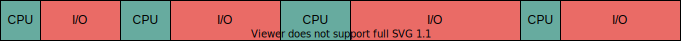
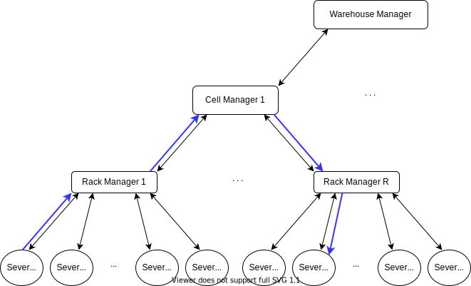
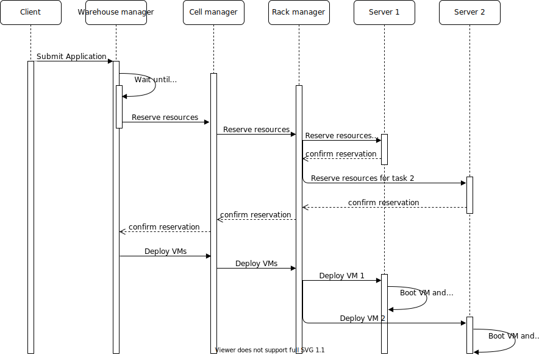

# Cloud Model
## Cloud user
<p style="text-align: justify;text-justify: inter-word;"> 
A cloud user is a person or organization that has access to the cloud and is allowed on demand usage of some of the cloud's resources for a limited time and for a predefined fee (based on the time of usage and the number of used resources). The cloud user reserves resources on the cloud to execute an application.
</p>


## Cloud resources
<p style="text-align: justify;text-justify: inter-word;"> 
A cloud consists mainly of many homogeneous servers interconnected by an Ethernet network. Each server might have many processors and each processor consists of many cores. The servers might also have accelerators such as GPUs and TPUs. The cloud user expresses its resource requirements to execute a Task in terms of VCPUs and memory. A VCPU can be the equivalent of one core or one core-thread on a server. Some cloud service providers force users to select resources for their tasks form a predefined list of instances. Each instance has a predefined number of VCPUs and memory. 
Even though the user cannot choose over which server the resources are reserved to execute a given task, they are all located on the same server. The resource manager does not reserve resources on different servers for the same task. If a task requires more resources than those available on a server, it should be partitioned into two or more tasks which can be deployed in parallel on different servers and communicate over the network by exchanging messages or remote call procedures.
</p>

## Sleeping states of the computing resources
<p style="text-align: justify;text-justify: inter-word;"> 
Modern processors and cores have many PC and C sleeping states respectively. They are used to reduce their energy consumption when they are idle. When  a core is put to a C-state higher than C0, it stops executing instructions and turn off some of its components. When a core moves to a deeper C-State it consumes less energy but requires more time to wake up from this deep sleep state in order to execute some instructions. When all the cores of a given processor are in a CX sleeping state, the processor can be also put to the PCX sleeping state. The PC state of a processor cannot be higher than the minimum C-state of its cores. If all the processors of a server are in their last PC-State, the whole server can be turned off to save even more energy.
</p>

## Task
<p style="text-align: justify;text-justify: inter-word;"> 
A task is deployed on the reserved resources on the cloud and can contain a predefined set of stages to execute over these resources. Those stages can be one of the following: Execute a number of instructions, Read/Write an amount of data from memory or local disks, send and receive data over the network, etc. Before the execution of the task on the reserved resources, an adapted environment that satisfies the requirements of the task must be available on these resources. The most common two scenarios for this situation are: 
<ul>
  <li style="text-align: justify;text-justify: inter-word;">A general environment that contains the most common packages is already available on the resources and the task's dependencies are all satisfied by this environment which is rarely the case for complex tasks. </li>
  <li style="text-align: justify;text-justify: inter-word;">The user has to build an environment that contains all the application's requirements, starting from the selection of the operating system and its configuration to the installation of all the required packages and services such as execution environments, databases, libraries, etc. An image of this environment can be saved into a file to be reused and deployed over the reserved resources before the execution of the application. Most of the time on the cloud, a system image is deployed in a virtual machine because the resources of the cloud's servers might be shared between many applications requiring different environments.</li>
  </ul>
</p>

## Stage
<p style="text-align: justify;text-justify: inter-word;"> 
When executing a task over a processor, the processor will execute sequentially the different instructions of the task. The instructions of the task are defined by the developer of the task using high level programming language such as Java or C, etc. However, to execute these instructions on a processor they must be first transformed into machine instructions such as load and store data or arithmetic operations over data in the registers. A single instruction in a high-level language might be transformed into many machine instructions. In theory, a modern processor can execute on average more than one instruction per cycle because it uses pipelining and has many execution units. In practice, this could be the case if all the data required to execute the arithmetic instructions is already in the registers of the processor and no memory reads are required. At the beginning of the task all the data is on the memory (RAM) and even the task's instructions are also on the memory. Therefore, the processor has to load the data to the registers of the processor before applying the task's arithmetic operations over the data. Moreover, since the processor has a limited number of registers, it cannot load all the task's data to its registers. It can on the other hand prefetch some data and store them in its cache memory which is faster to access than RAM but has also a very limited size.  Memory access is very expensive, about 100 processor cycles to fetch a word from memory because the clock rate of the memory bus is much slower than the clock rate of the processor. If the processor is executing the instructions in order, it has to wait for the reception of the data before executing the next instruction and it would be idle during 100 cycles. In modern processors, out of order execution is possible for independent instructions. A processor can execute future independent instructions while waiting for IO. However, if the future instructions depend on the fetched data the execution of the task is blocked until receiving the data. Therefore, the execution of a task consists of  very small alternating CPU burst periods and CPU idle periods as shown in the following figure. If two tasks are being executed, the scheduler stops the task waiting for data and allocate the CPU cycles to the second task if its ready for execution.  
</p>
<p align="center">
<br/>
CPU burst and idle periods while executing a task.
</p>
<p style="text-align: justify;text-justify: inter-word;"> 
To make it easy to model a task execution, the CPU burst periods are regrouped together to form a large stage of computation and CPU idle periods are also regrouped together to form a large stage of Memory access. Therefore, a task can be assumed to consists of different large stages of similar instructions instead of very small alternating stages. In other words, instead of defining a computation stage for each arithmetic operation and an IO stage for each data transfer instruction, one large computation stage including all the arithmetic operations of a task and one large IO stage including all the IO memory operations are defined. Of course, many synchronous communication stages can be added to a task and between the communication stages, large stages of computation and IO can exist as shown in the following figure. 
</p>
<p align="center">
<br/>
</p>

## Example of a simple task
<p style="text-align: justify;text-justify: inter-word;"> 
A Task can be directly defined in the Java code or it can be generated by another script as an XML file. The latter method is preferred because it allows the user of the simulator to simulate the execution of many sets of tasks without any modification to the simulator's code and without requiring any new compilation of code nor re-deployment of the byte code. In the following code, an XML example of the definition of a task with multiple stages. The task's description file starts with a description of the virtual machine that should be booted before executing the task. The size of the image is given in MB and it is used to compute the transfer time of the image to the server where it should be booted. The number of instructions to boot and to turn off the virtual machine are also given and used to estimate the virtual machine boot and turn off times. The parallel parameter is set to true when all the reserved VCPUs can be used to turn on/off the virtual machine. Otherwise, just one VCPU can be used to execute these instructions. After the virtual machine's description, the requirements of the task are specified in the instance node. The most important values to specify are the number of VCPUs ans the amount of memory. For the current version of the simulator a VCPU is the equivalent of a physical core. in this example, the task requires two cores and 4000 MB of memory to run. Finally, the different stages of the task are described. For each stage, the type of the stage should be given (EXEC for computation, IO_MEMORY for memory access, etc.) and some values related to the type of the stage are also required, for example the number of instructions (size tag) for the EXEC stage, the size of data to read/write (size tag) for the IO_MEMORY stage, etc. The order of the stages in the description XML file will be respected by the simulator.
</p>

```xml
<task>
  <virtualMachine>
      <os>Debian</os>
      <size>750</size>
      <instructionToBoot>50000</instructionToBoot>
      <instructionsToTurnOff>50000</instructionsToTurnOff>
      <parallel>true</parallel>
  </virtualMachine>
  <instance>
    <name>a.small</name>
    <nbVCPUs>2</nbVCPUs>
    <memory>4000</memory>
  </instance>
  <stage>
    <type>IO_MEMORY</type>
    <size>7536478</size>
  </stage>
  <stage>
    <type>EXEC</type>
    <size>51145</size>
  </stage>
  <stage>
    <type>IO_MEMORY</type>
    <size>11381876</size>
  </stage>
</task>
```


## Multi-threaded task
<p style="text-align: justify;text-justify: inter-word;"> 
A task that requires many VCPUs cannot fully use these VCPUs unless it is multi-threaded. Therefore, the task has a main process that starts when the virtual machine is booted. This main process has a predefined set of stages to execute as defined in the previous paragraph. However, in order to use more than one VCPU at a time, the main process can create new processes with their own sets of stages to execute. These processes can be executed in parallel and exchange data using shared memory. To execute a number of instructions, a process has to lock a VCPU during the execution and free it at the end. If all the VCPUs are taken, a process can force another process to stop its execution and release its VCPU, if it has a higher priority. Otherwise, the process has to wait for a VCPU to be freed in order to execute its instructions. The following XML code describes the main process that creates a new process after executing two compute and I/O stages. In this example, the new process has to execute just one compute stage containing 101975 instructions on another VCPU. The main process keeps on executing its following stages in parallel with the new created process.
  
</p>

```xml
<stage>
  <type>IO_MEMORY</type>
  <size>7536478</size>
</stage>
<stage>
  <type>EXEC</type>
  <size>51145</size>
</stage>
<stage>
  <type>CREATE_PROCESS</type>
  <stage>
    <type>EXEC</type>
    <size>101975</size>
  </stage>
</stage>
<stage>
  <type>EXEC</type>
  <size>102073</size>
</stage>
```

## Service task
<p style="text-align: justify;text-justify: inter-word;"> 
A service task does not have a predefined set of stages to execute. However, it is a service that is turned on when the virtual machine is booted. The service listens over a predefined port and waits for the reception of independent transactions. When the service receives a transaction, it creates a new process to handle this transaction. A transaction consists of a set of stages to execute. When all the stages are executed, the process is terminated. The task service can only be turned off by the user that deployed it or by the cloud manager if the resource reservation time has expired. The following XML code describes a transaction. The size and responseSize tags contain respectively the size of the transaction's data and the size of the transaction's response. Both values will be used to compute the transmission time over the network. The submission time is when the transaction will be submitted to the cloud. This value could be computed according to a chosen probability distribution that best suits the objectives of the experiment. The stages of a transaction are similarly described as those of a regular task.
</p>

```xml
<transaction>
  <size>10</size>
  <responseSize>10</responseSize>
  <submissionTime>212.1035258127757</submissionTime>
  <stage>
    <type>IO_MEMORY</type>
    <size>1344355</size>
  </stage>
  <stage>
    <type>EXEC</type>
    <size>2083293310</size>
  </stage>
</transaction>
```

## Application
<p style="text-align: justify;text-justify: inter-word;"> 
To simulate distributed computing, the Application concept was introduced. An application consists of at least one task which can be multi-threaded or service tasks. If an application has more than one regular task with a predefined set of stages, the tasks can communicate with each other via the main process on each task. The main process of a task that has to send some data to another task, must include, as with the MPI interface, a SEND stage where the recipient task and the size of the data to transfer are specified. On the other hand, the task receiving the data from another task, should include a WAIT_RECV stage where the sender task and the size of the data to be received are also specified. The following XML code describes an application consisting of two regular tasks. Each task has five stages and on the third stage, each task sends data to the other one. On the fourth stage, each task waits to receive the data sent by the other task then executes the fifth stage. Finally, the application has a submission time which specifies when the application would be submitted to the cloud. 
</p>

```xml
<app>
  <submissionTime>2</submissionTime>
  <task>
    <virtualMachine>
      <os>Debian</os>
      <size>750</size>
      <instructionToBoot>50000</instructionToBoot>
      <instructionsToTurnOff>50000</instructionsToTurnOff>
      <parallel>true</parallel>
    </virtualMachine>
    <instance>
      <name>a.small</name>
      <nbVCPUs>2</nbVCPUs>
      <memory>4000</memory>
    </instance>
    <stage>
      <type>IO_MEMORY</type>
      <size>7536478</size>
    </stage>
    <stage>
      <type>EXEC</type>
      <size>51145</size>
    </stage>
    <stage>
      <type>SEND</type>
      <source>0</source>
      <destination>1</destination>
      <sizeMessage>100</sizeMessage>
    </stage>
    <stage>
      <type>WAIT_RECV</type>
      <source>1</source>
      <destination>0</destination>
      <sizeMessage>100</sizeMessage>
    </stage>
    <stage>
      <type>EXEC</type>
      <size>101975</size>
    </stage>
  </task>
  <task>
    <virtualMachine>
      <os>Debian</os>
      <size>750</size>
      <instructionToBoot>50000</instructionToBoot>
      <instructionsToTurnOff>50000</instructionsToTurnOff>
      <parallel>true</parallel>
    </virtualMachine>
    <instance>
      <name>a.small</name>
      <nbVCPUs>2</nbVCPUs>
      <memory>4000</memory>
    </instance>
    <stage>
      <type>IO_MEMORY</type>
      <size>7456772</size>
    </stage>
    <stage>
      <type>EXEC</type>
      <size>60234</size>
    </stage>
    <stage>
      <type>SEND</type>
      <source>1</source>
      <destination>0</destination>
      <sizeMessage>100</sizeMessage>
    </stage>
    <stage>
      <type>WAIT_RECV</type>
      <source>0</source>
      <destination>1</destination>
      <sizeMessage>100</sizeMessage>
    </stage>
    <stage>
      <type>EXEC</type>
      <size>110005</size>
    </stage>
  </task>
</app>
```

<p style="text-align: justify;text-justify: inter-word;">  
If an application consists of many service tasks, they do not exchange any data because the transactions are independent. The application of service tasks allows the deployment, at the same time, of many service tasks that handle the same type of transactions. This redundancy is used when one server does not have enough resources to handle the transactions' load. In this case, a dispatcher, located on a higher-level than the servers, can be the point of entry of the transactions. Once it  receives a transaction, it will submit the transaction to one of the deployed service tasks according to a predefined policy. The following XML code describes an application consisting of two service tasks. The application's description also includes the transactions that will be submitted to those tasks. The transactions must be ordered by their submission times.
</p>

```xml
<app>
  <submissionTime>2</submissionTime>
  <task>
    <virtualMachine>
      <os>Debian</os>
      <size>750</size>
      <instructionToBoot>50000</instructionToBoot>
      <instructionsToTurnOff>50000</instructionsToTurnOff>
      <parallel>true</parallel>
    </virtualMachine>
    <instance>
      <name>a.small</name>
      <nbVCPUs>8</nbVCPUs>
      <memory>8000</memory>
    </instance>
  </task>
  <task>
    <virtualMachine>
      <os>Debian</os>
      <size>750</size>
      <instructionToBoot>50000</instructionToBoot>
      <instructionsToTurnOff>50000</instructionsToTurnOff>
      <parallel>true</parallel>
    </virtualMachine>
    <instance>
      <name>a.small</name>
      <nbVCPUs>8</nbVCPUs>
      <memory>8000</memory>
    </instance>
  </task>
  <transaction>
    <size>10</size>
    <responseSize>10</responseSize>
    <submissionTime>1.7625516688400111</submissionTime>
    <stage>
      <type>IO_MEMORY</type>
      <size>1083482</size>
    </stage>
    <stage>
      <type>EXEC</type>
      <size>2593392239</size>
    </stage>
  </transaction>
  <transaction>
    <size>10</size>
    <responseSize>10</responseSize>
    <submissionTime>1.9176792525859794</submissionTime>
    <stage>
      <type>IO_MEMORY</type>
      <size>41322</size>
    </stage>
    <stage>
      <type>EXEC</type>
      <size>54149119470</size>
    </stage>
  </transaction>
  .
  .
  .
</app>
```

# Simulated cloud infrastructure
<p style="text-align: justify;text-justify: inter-word;"> 
Warehouse-scale computers (WSCs) are the building blocks of a cloud infrastructure. A WSC consists of tens of thousands of
servers and has a hierarchical organization as shown in the following figure. A rack consists of S servers, each server has P processors, each processor has C cores, and each core has T threads. A number R of racks form a cell and the WSC consists of N cells. Each node in the hierarchy is controlled by software modules called managers which handle the requests of the users and manage the physical components of the simulated cloud.   These managers compose the logical infrastructure of the cloud  and their various roles are explained in the following sections. 
</p>
<p align="center">

</p>
<p style="text-align: justify;text-justify: inter-word;"> 
In the implemented simulator, each node of the hierarchy can only communicate with its parent node or its children via messages. In order, to exchange data with other nodes, the data must be transmitted via intermediary nodes, according to the hierarchy illustrated in the following figure, to reach their destinations. For example, if a task on server 1 from rack 1 wants to send data to a task on server 2 on rack R, its messages have to successively transit by the Rack manager 1 (parent node), Cell manager 1 and Rack manager R before reaching its destination (server 2 on rack R), as illustrated by the blue arrows in the following figure. This communication scheme imitates real ethernet networks where servers in a rack are interconnected via a switch which in the simulator is represented by the Rack manager, every group of racks are also interconnected via another switch which in the simulator is represented by the Cell manager, etc. Since our distributed simulator uses a pessimistic approach where a process can only execute a local event when its time stamp is lower than the minimum time stamp + lookup of its neighbors, this communication scheme was implemented in order to reduce the dependencies between the processes of the simulator. For example, using this communication scheme, a Server manager only has one neighbor, the Rack manager, instead of having all the servers of the simulation as its neighbors. </p>

<p align="center">

</p>

## Warehouse manager
<p style="text-align: justify;text-justify: inter-word;">
It is the entry point of a WSC. It receives the applications submitted by clients. For each application, it checks if there are enough resources to execute all the tasks of the submitted application. The requirements of each task in the application are expressed in number of VCPUs and amount of memory. the resources must be reserved on the same server because a VM can only be hosted on a single server. If the WSC has enough resources the required resources are reserved and for each task a VM is deployed with the necessary resources to execute the task. Otherwise, the application is added to the waiting list until enough resources are freed up to satisfy the application's requirements.
</p>

### Application deployment procedure
<p style="text-align: justify;text-justify: inter-word;">
  The Warehouse manager has an estimate of the available resources on each server. However, these values maybe outdated for many reasons. For example, if a server's resources are underutilized, its server manager might decide to turn off some available resources in order to save energy and thus modifying the number of available VCPUs on this server. The warehouse manager will be eventually informed of this modification but the update would not instantly happen. The information must be transferred from the server to the Rack manager and then to the Cell manager in order to finally arrive to the Warehouse manager. To be able to deploy a submitted application to the WSC, an application deployment procedure consisting of two phases was implemented. During the first phase, the logical components of the cloud try to reserve the requested resources by the Application. If the first phase is a success, the tasks are then deployed onto the reserved resources. Otherwise, the application is added to the waiting list. Both phases are described in the next two paragraphs and illustrated in the following figure where the tasks of an application are deployed on two servers with enough resources. 
</p>

<p style="text-align: justify;text-justify: inter-word;">
  First phase: The Warehouse manager, for every task in the application and according to its local available resources values,  checks if there is a server that can satisfy the task's requirements. If a server was found for every task of the application, the reservation procedure begins, otherwise the application is added to the waiting list. In the reservation procedure, a message is sent to all the selected servers through their Cell managers and Rack managers to reserve them. If by the time the server receives the reservation message, its resources are not available anymore, the Rack manager tries to reserve resources on another server in the rack. If it is not possible, the cell manager tries to reserve a server on another rack. 
</p>

<p style="text-align: justify;text-justify: inter-word;">
Second phase: if the first phase was successful, the deployment of the virtual machines for every task of application on the reserved servers begins. Otherwise, the application is added to the waiting list until some resources free up. During this second phase, a message is sent to every reserved server to load the VM image to the memory and boot the virtual machine. Once, it is booted, it starts executing the stages of its task. 
</p>

<p align="center">

</p>

## Cell manager
<p style="text-align: justify;text-justify: inter-word;">
  It manages a number of racks. It is the link between the warehouse manager and the racks managers. All the warehouse requests for resource reservation and tasks submissions are transferred via the Cell manager to the racks.
</p>

## Rack manager
<p style="text-align: justify;text-justify: inter-word;">
It handles the servers in a rack. All the warehouse requests for resource reservation and tasks submissions are transferred from the Cell manager to the servers via the Rack manager. If more than one identical service tasks were deployed on the servers of one rack, the Rack manager can host a dispatcher to dispatch the transactions to the service tasks according to a predefined policy. Therefore, the Rack manager will become the entry point of the transactions submitted to the service tasks.
</p>

## Server manager
<p style="text-align: justify;text-justify: inter-word;">
It handles the resources of the server: processors, memory, network card, disks, etc. It also allocates these resources to the submitted tasks to execute them. Moreover, the Server manager can run multiple procedures to save energy by putting to sleep some or all of the server's resources. The resource allocation and resource management policies can be designed to serve various purposes such as performance, responsiveness or energy saving.<br/>
Once some resources are reserved for a regular task, a virtual machine is booted over these resources and then the stages of the task are successively executed. When all the stages of the task have been executed, the VM is turned off and the task's resources are freed up. Finally, the Rack manager is notified of the termination of the task. On the other hand, for a service task, once the VM is booted, the dispatcher starts submitting the transactions of the application to the task. Upon the reception of a transaction, the task creates a process to execute the transaction's stages. When all the stages of the transaction have been executed, the process handling it is killed and the dispatcher is notified. When all the transactions of an application have been executed, the VM is turned off and the task's resources are freed up.
</p>

# Server's Resources definition
<p style="text-align: justify;text-justify: inter-word;">
The server's resources are defined in the main function of a Java class that launches a ServerManager. In the following Java code example, the program takes at least 4 parameters: the server's name or IP address, the server's port number, the Rack manager's name and the Rack manager's port number. These informations are required to connect the Server manager to the Rack manager. The code defines the server's resources, binds the server to the Server manager and then starts the simulation process of the Server manager. In the following code, a server, containing 2 homogeneous processors and 4 cores per processor with 16 GB of memory, is defined. Various parameters for the memory, processors, network are also specified. The values of these parameters have to be chosen by the user of the simulator. The ones given in this example were intuitively chosen and are not related to a real computing node. The different policies and models that specify the behavior or energy consumption of each component in the server, should also be defined by the user of the simulator. These models and policies are discussed in other sections below.
</p>

```java
public static void main(String []args) {
  if(args.length<4) {
    System.out.println("Usage: serverName, serverPort, rackName, rackPort, [serverSpecFileName]");
    System.exit(0);
  }

  PowerAwareServerManager serverManager=null;
  PowerAwareServer server=null;
  String serverName="", rackName="";
  int serverPort=0, rackPort=0;

  try {
    serverName=args[0];
    rackName=args[2];
    serverPort=Integer.parseInt(args[1]);
    rackPort=Integer.parseInt(args[3]);
  }catch(Exception e) {
    e.printStackTrace();
    System.out.println("Usage: serverName, serverPort, rackName, rackPort, [serverSpecFileName]");
    System.exit(0);
  }
  try {
    int nbProcs=2, nbCoresPerProc=4; //number of processors and number of cores per processor
    int memoryPerCore=2;  //memory per core in GB

    //Memory
    double totalMemorySize=nbProcs*nbCoresPerProc*memoryPerCore; // total memory size in the server
    Vector<Integer> frequencies=new Vector<Integer>();
    frequencies.add(new Integer(200)); //possible frequencies of the memory in MHz
    int defaultFrequencyIndex=0; //Which frequency is selected at the beginning of the simulation 
    Vector<Double> powerPerFrequency=new Vector<Double>();
    double dynamicMemoryPowerPerGB=1.5; //power consumed per 1 GB of memory when active
    double staticMemoryPowerPerGB=0.5;  //power consumed per 1 GB of memory when idle
    powerPerFrequency.add(new Double(totalMemorySize*dynamicMemoryPowerPerGB));//power consumed by all the memory when active at 200MHz
    double latency=0.01; //latency in seconds
    PowerAwareMemory memory=new PowerAwareMemory(totalMemorySize*1000,frequencies,defaultFrequencyIndex,latency, totalMemorySize*staticMemoryPowerPerGB,powerPerFrequency);  //instantiate the memory with a transfer rate in MB/s = frequencies*64
    
    memory.setMemoryAccessModel(new MemoryAccessModel(memory)); //set the memory access model
    memory.setEnergyConsumptionModel(new MemoryEnergyConsumptionModel(memory)); //set the memory energy consumption model
    
    //Server Manager
    serverManager = new PowerAwareServerManager(serverName, serverPort, rackName, rackPort); //instantiate the Server manager
    serverManager.setProvisioningPolicy(new SimpleProvisioningPolicy()); //set the Server manager resource provisioning policy
    serverManager.setVCPUAllocatingPolicy(new EnergyEfficientVCPUAllocatingPolicy()); //set the Server manager VCPU allocation policy
    
    //Network card
    int bandwidth=10000; //Bandwidth in MB
    double upperLevelPropagationTime=0.1, lowerLevelPropagationTime=0.1; //Propagation time in the hierarchy in seconds
    SimpleCommunicationModel communicationModel=new SimpleCommunicationModel(bandwidth, upperLevelPropagationTime, lowerLevelPropagationTime,serverManager ); //Initiate the communication model
    double staticPower=2, dynamicPower=10;
    PowerAwareNetworkCard networkCard=new PowerAwareNetworkCard(communicationModel,staticPower,dynamicPower);   //instantiate a network card
    networkCard.setEnergyConsumptionModel(new NetworkCardEnergyConsumptionModel(networkCard)); set the network card energy consumption model
    
    //Server
    double timeToWakeUp=20; //time to change state from asleep to awake in seconds
    double awakePowerConsumption=10, //sleepPowerConsumption=0; power conseumption in each state in Watts
    server=new PowerAwareServer(serverManager, memory,networkCard, timeToWakeUp, awakePowerConsumption, sleepPowerConsumption);  //instantiate the server
    server.setComputingModel(new ComputingModel(server)); //set the server's computing model
    server.setEnergyConsumptionModel(new ServerEnergyConsumptionModel(server)); //set the server's energy consumption model
    memory.setServer(server);

    for(int i=0;i<nbProcs;i++) {
      //Processor
      Vector<Double> power_per_PCstate=new Vector<Double>(); //processor's power consumption per PC-state in watts
      power_per_PCstate.addAll(Arrays.asList(15.0,7.5,0.0));
      int defaultPCstateIndex=0;
      Vector<Double> delayToWakeUpFrom_PCstate=new Vector<Double>(); //processor's delay to pass from a PC_state to the first one in seconds
      delayToWakeUpFrom_PCstate.addAll(Arrays.asList(0.0,7.5,15.0));
      CacheMemory l3 =new CacheMemory(12*1000,30); //size in KB and latency in cycles
      PowerAwareProcessor processor=new PowerAwareProcessor(server,l3, power_per_PCstate, defaultPCstateIndex, delayToWakeUpFrom_PCstate); //instantiate a processor
      processor.setEnergyConsumptionModel(new ProcEnergyConsumptionModel(processor)); //set the processor's energy consumption model

      for(int j=0;j<nbCoresPerProc;j++) {
        //Core
        frequencies=new Vector<Integer>();
        frequencies.addAll(Arrays.asList(2000,1750,1500,1250,1000)); //core's frequencies in MHz
        defaultFrequencyIndex=0;
        powerPerFrequency=new Vector<Double>();
        powerPerFrequency.addAll(Arrays.asList(36.94,28.77,22.4,17.45,13.59)); //core's power consumption per frequency in watts
        Vector<Double> powerPerCState=new Vector<Double>();
        powerPerCState.addAll(Arrays.asList(15.0,7.5,0.0)); //core's power consumption per C-state in watts

        Vector<Double> delayToWakeUpFrom_Cstate= new Vector<Double>();
        delayToWakeUpFrom_Cstate.addAll(Arrays.asList(0.0,7.5,15.0)); //core's delay to pass from a C_state to the first one in seconds
        int defaultCStateIndex=0;
        int nbInstructionsPerCycle=1;
        PowerAwareCore core=new PowerAwareCore(frequencies,defaultFrequencyIndex,powerPerFrequency,defaultCStateIndex,powerPerCState,delayToWakeUpFrom_Cstate,nbInstructionsPerCycle,processor,server); 
        core.setEnergyConsumptionModel(new CoreEnergyConsumptionModel(core));  //set core energy consumption model
        processor.addCore(core); // add core to the processor
      }
      server.addProcessor(processor); //add processor to the server
    }
    serverManager.setLoadHandlingPolicy(new SimpleLoadHandlingPolicy()); //set the load handling policy
    
    //Should be called when all the processors and cores have been added to the server
    serverManager.setServerAndStartSimulation(server); // Starts the simulation process of the Server manager
    
  }catch(IllegalArgumentException e) {
    e.printStackTrace();
  }
}
```

# Package organization
<p style="text-align: justify;text-justify: inter-word;">
The Java code of the simulator is located in the src directory and is organized as follows:
<ul>
  <li> <span style="font-weight: bold">core package: </span>This package contains the core classes of the simulator. The user of the simulator should not modify the content of this package.</li>
  <li> <span style="font-weight: bold">energy packahe: </span>This package contains some subclasses of classes from the core package. These subclasses contain new attributes and methods that are essential for tracking the energy consumption of every component of a server. Moreover, this package contains procedures to manage the resources of the servers and the tasks running over them in order reduce the overall energy consumption of the cloud. For example, it includes procedures to migrate a task from one server to another and to put some resources to sleep. The user of the simulator is not supposed to modify the content of this package too.</li>
  <li> <span style="font-weight: bold">enumerations package: </span>This package contains all the enumerations used by the simulator such as the simulation states, the task states, the stage types, etc. The user of the simulator can add new values to these enumerations to handle new stage types or task states, etc.
  </li>
  <li> <span style="font-weight: bold">events package: </span>This package contains just subclasses of the Event class. These subclasses define specific types of events and how they must be processed by the Server manager. The user of the simulator can add to this package new event subclasses to handle new event types.
  </li> 
  <li> <span style="font-weight: bold">examples package: </span>This package contains the launchers of the Warehouse, Cell, rack and Server managers. These launchers take many arguments such as the name of the machine on which to run the coresponding manager and which port number to use for communication. More information on the arguments of each launcher can be found in the Example section below. The Warehouse manager launcher requires an XML file which describes the applications that the simulator should execute over the simulated cloud. The structure of the XML file was described in the Application section above. In this package, the user of the simulator must define the architecture of the cloud's servers. I should be done in the Server manager launcher as described in the previous section. It must be noted that the cloud can consist of heterogeneous servers. However, in reality most clouds are homogeneous.    
  </li>
  <li> <span style="font-weight: bold">models package: </span>This package contains the models which define the behavior of each component of the server. For example, the server has memory, processors and a network card. The compute model defines how the processor simulates the execution of a stage. The communication model defines how the network card sends a message, etc. There are also models to compute the energy consumption of each component during a time period. Simple models were implemented for each component but the user of the simulator can implement new ones that are more adapted to his needs.
  </li>
  <li> <span style="font-weight: bold">policies package: </span>This package contains the policies that the different managers will apply to provision resources to a task, allocate a VCPU to a process, handle the idle and overloaded provisioned resources, handle the unprovisioned resources, etc. Simple policies were implemented when required and more complex ones were submitted in research papers for publication. The user of the simulator can use the available policies or develop its own policies. The objective of this simulator is mainly to allow its users to evaluate the effect of new policies on the behavior and energy consumption of the simulated cloud. 
  </li>
  <li> <span style="font-weight: bold">stages package: </span>This package contains just subclasses of the Stage class. These subclasses define specific types of stages and how they must be processed by the Server manager. The most common stages of a task were implemented, such as compute, memory access, message send and receive stages. The user of the simulator can add to this package new stage subclasses if the ones available do not cover its needs. The user can also modify how a stage is processed by the Server manager.
  </li>
  <li> <span style="font-weight: bold">stats package: </span>This package contains the classes that define which data must be retrieved from the simulation, which statistical analysis should be applied on them and how the results should be displayed for the user of the simulator. The latter can modify those three steps according to his needs.
  </li>
</ul>
</p>

# Getting started 

## Sytsem requirements
<p style="text-align: justify;text-justify: inter-word;">
The following softwares are required to run the simulator :
  <ul>
    <li> <span style="font-weight: bold">Operating System:</span> The simulator has been tested on systems running OS X or linux operating systems. The simulator was not tested on the windows operating system but it should work with some tweaking. </li> 
    <li> <span style="font-weight: bold">Git:</span> The git software (available per default on linux based systems) is required to clone the source code from github but it can also be downloaded as an archive without git, see next paragraph.</li>
    <li> <span style="font-weight: bold">Java Development Kit (JDK):</span> To compile the source code and run the simulator a recent JDK must be installed on the machine.</li>
    <li> <span style="font-weight: bold">Java make:</span> The make utility (available per default on linux based systems) is used to compile le source files of the simulator. However, the shell commands found in the Makefile can be used to compile the code without this utility.</li>
  </ul>  
</p>

## Download
<p style="text-align: justify;text-justify: inter-word;">
To start using this simulator the source code must be downloaded on the filesystem of the machine (or machines) that will be running the simulation. The source can be downloaded using one of the following two ways:
  <ol>
    <li> From a terminal, execute the following GIT instruction, the git software must be already installed on the machine:<br/><span style="font-weight: bold">git clone https://github.com/jccharr/DistributedCloudSimulator.git</span></li>
    <li> Or just click on the following link to download an archive containing the source files and then uncompress the downloaded archive: <a href="https://github.com/jccharr/DistributedCloudSimulator/zipball/master"> download link</a></li> 
  </ol>
</p>

## Compile 
<p style="text-align: justify;text-justify: inter-word;">
  In a terminal change the current directory to the uncompressed directory: <span style="font-weight: bold">cd DistributedCloudSimulator</span> <br/>
  To compile just execute the following instruction from a terminal: <span style="font-weight: bold">make</span> <br/>
  The .class files will be generated in the bin directory. <br/>
  To remove the compiled .class files execute : <span style="font-weight: bold">make clean</span>
</p>

## Run a simulation on the local machine
<p style="text-align: justify;text-justify: inter-word;">
To run the simplest simulation with this simulator, at least four processes should be launched, one for each manager type: Warehouse, Cell, Rack and Server managers. In the following example, a cloud containing just one Rack consisting of two servers is simulated. Each of the follwing instructions should be executed in its own terminal tab and launches one of the managers. Since all the processes in this example will be executed on the local machine, the machine name is equal to 127.0.0.1 for all the processes and they only use differents ports to communicate with each other. As explained in Server's Resources definition section, the ServerLauncher class should be edited to specify the specifications of the servers.
  
  <ol>
    <li>To launch the Warehouse manager: <span style="font-weight: bold">java bin/examples/WarehouseLauncher 127.0.0.1 961 apps.xml</span><br/>The Warehouse manager uses the port 961 to communicate with the other components. The app.xml file contains the definition of the tasks that will be executed by the simulated cloud as explained in the Task and Application sections.</li>
    <li>To launch a Cell manager: <span style="font-weight: bold">java bin/examples/CellLauncher 127.0.0.1 962 127.0.0.1 961 </span><br/>The Cell manager uses the port 962 to communicate with the other components and requires the name of the machine running the upper node in the hierarchy (Warehouse manager) and its port number to connect to it.</li>
    <li>To launch a Rack manager connected to the Cell manager above: <span style="font-weight: bold">java bin/examples/RackLauncher 127.0.0.1 963 127.0.0.1 962 2 </span><br/>As for the Cell manager, it requires the name of the machine running the upper node in the hierarchy (Cell manager) and its port number to connect to it. Moreover, the user of the simulator must specify in the last argument, how manu servers will be connected to this Rack manager, in this example just 2 servers. </li>
    <li>To launch the first Server manager connected to the Rack manager above: <span style="font-weight: bold">java bin/examples/ServerLauncher 127.0.0.1 964 127.0.0.1 963 </span><br/>Similar to the other manager, it  requires the name of the machine running the upper node in the hierarchy (Rack manager) and its port number to connect to it.</li>
    <li>To launch the second Server manager connected to the Rack manager above: <span style="font-weight: bold">java bin/examples/ServerLauncher 127.0.0.1 965 127.0.0.1 963</span>
    </li>
  </ol>
  
Off course the simulation of a cloud consisting of many racks and tens of servers per rack, would not be practical if every manager should be lauched on its own as above. In the next section, an automated launch process is explained to launch the simulator over a cluster and to simulate a larger cloud.
</p>

## Run a simulation on a cluster
<p style="text-align: justify;text-justify: inter-word;">
<span style="font-weight: bold">Requirements: </span> In this section, it is assumed that the machines that are supposed to run the simulation has been reserved by the user of the simulator and that he can ssh from one machine to the other without requiring the input of the password. Moreover, it is assumed that those machines share the same network file system (NFS). Finally, it is assumed that the user has the permissions to execute the simulator over these machines and to write the output on the NFS.</p>

<p style="text-align: justify;text-justify: inter-word;">
<span style="font-weight: bold">The machines running the simulation: </span>The names of the machines to be used by the simulator should be listed in a file, one name per line. The same name can be added more than once into the file, one manager process will be launched for each occurence. In the following example, this file is called machinesFile. The script addPortsToMachinesFile.py takes the machine file as argument, associates a port number to each machine name in the machines file and saves them in a new file called "machinesFileWithPorts". Each line of this new file has the following format: machineFileName portNumber. If the same machine name appears more than once in the first file, the script will associate a different port number for each occurence.</p>

<p style="text-align: justify;text-justify: inter-word;">
<span style="font-weight: bold">Launching the simulator: </span> To launch the simulation on the reserved machines, the launch script ("launchScript.py") should be executed. It taskes the numbers of cells, racks per cell and servers per rack as input. It also requires the machines file with the ports numbers, the applications' description XML file and an optional output directory. The following command is an example for simulating a cloud consisting of 1 cell, 1 rack per cell and 2 servers per rack:
</p>

```shell
python launchScript.py cells=1 racks=1 servers=2 machinesFile=machinesFileWithPorts appsDescriptionFile=apps.xml outputDirectory=out
```
<p style="text-align: justify;text-justify: inter-word;">
<span style="font-weight: bold">Launching many simulations on the same cloud: </span> If the user would like to simulate many applications' senarios on the same cloud architecture, we have developped another python script called "loop_script.py" that takes almost the same parameters as the launch script. However, instead of an apps description file, it takes a directory containing the files describing the apps. The script launches a simulation with each apps description file in the directory. The simulations are executed successively, one after the other. A file called "loop_lock" is used to detect if the current simulation is finished and to launch the next simulation. This script uses the launch script to launch each simulation. The following command is an example for launching a series of simulations on the same cloud infrastructure consisting of 1 cell, 1 rack per cell and 10 servers per rack:
</p>

```shell
python loop_script.py  cells=1 racks=1 servers=10 machinesFile=machinesFileWithPorts appsDescriptionDirectory=appsDirectory outputDirectory=out
```


